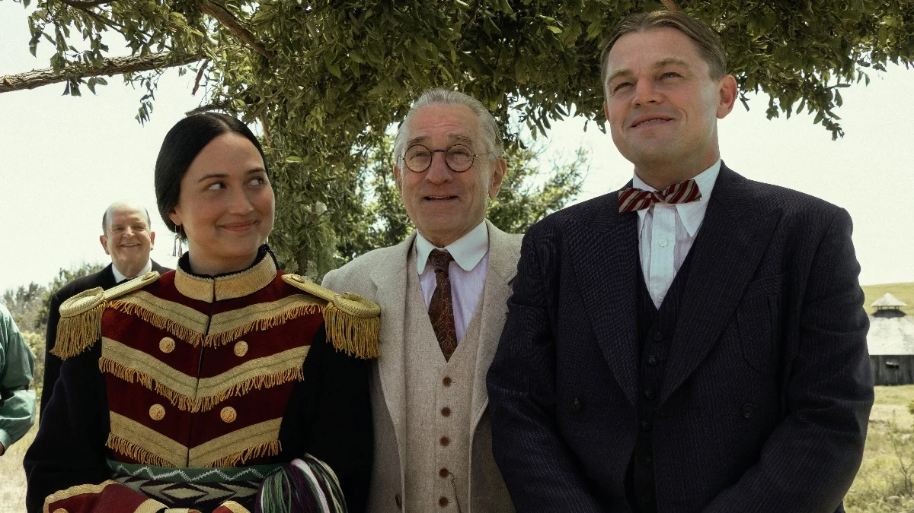
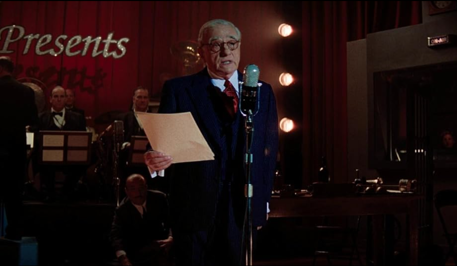

Hari itu tiba-tiba aja satu poster promo nya muncul di timeline dengan beberapa wajah tidak asing. Ya! Leo dan De Niro! Duo yang sangat apa telah diduetkan oleh el maestro Scorsese!?. Jadi pada saat itu aku sama sekali tidak membaca sinopsis atau bahkan menonton trailer filmnya, yang kulakukan adalah mencari jadwal tayang di bioskop karena saking excited nya!

Bukan tanpa alasan, hari itu aku gak tau kalau Martin Scorsese punya film baru. Dan tiba-tiba orang-orang ini muncul begitu saja. Begitu liat screen time yang dikit banget (kalah saing sama horror) takutnya filmnya gak laku di indo dan distop (tipe film kayak gini biasanya kurang diminati) sedang review bilang ini Cinema banget. Jadi rusuh, gak baca sinopsis dan trailer atau apapun itu wkwk. Soalnya aku suka banget sama The irishman wkwk dan ya! Yang nayangin dikit, rata rata cuma 2 screentime, sore sama malem.

## Synopsis
When oil is discovered in 1920s Oklahoma under Osage Nation land, the Osage people are murdered one by one - until the FBI steps in to unravel the mystery [[IMDB](https://www.imdb.com/title/tt5537002/)].

## Movie Details

| Title       | Body                              |
|-------------|-----------------------------------|
| Duration    | 206 minutes! not long enough yet! |
| Directed By | [Martin Scorsese](https://www.imdb.com/name/nm0000217/) |
| Writers     | [Eric Roth](https://www.imdb.com/name/nm0744839/), [Martin Scorsese](https://www.imdb.com/name/nm0000217/), [David Grann](https://www.imdb.com/name/nm2970418/) |
| Starring    | [Leonardo Dicaprio](https://www.imdb.com/name/nm0000138/), [Robert De Niro](https://www.imdb.com/name/nm0000134/), [Lily Gladstone](https://www.imdb.com/name/nm4291409/) |

## The Story
Aku nonton ini beneran no konteks dan agak syok dengan durasi yang sampe 3jam lebih 😭 mana nonton jam malem!

Awalnya agak ngangong, ini film setting nya kayak black panther yang ditonjolin emang kultur suku Indian yang begitu sederhana dalam menikmati hidup dan dianugerahi sumber daya alam yang sangat berharga pada saat itu, *oli!*. Intinya orang-orang pendatang pada dateng cuman mau rebutan oli we pokoknya mah, entah nikahin pribumi, ngebunuh, dll wkwk.

Jadi ada baiknya baca dulu tragedi oasage Indian sedikit aja, soalnya film nya gak nyuapin banget. Penulis nganggap yang nonton udah tau dikit jadi langsung aja di gas ceritanya. Tapi tenang, penceritaan yang sangat baik bikin orang yang gak tau konteks sama sekali bisa dibuat tertegun, penasaran, dan engage banget sama cerita dan seluruh tokoh yang terlibat. Emosi yang mereka rasakan, seorang penduduk asli yang secara sadar dimanfaatkan dan disisihkan oleh para pendatang yang hanya menginginkan harta kekayaan mereka. Namun, penduduk asli ini sangat berbesar hati menerima mereka dan terus memberikan kesempatan agar bisa hidup berdampingan.

Oke, film ini sangat mengingatkan aku sama film Scorsese sebelumnya, The irishman! Penceritaan yang ngalem, tiap adegan sederhana yang terjadi bukanlah hal yang sia-sia, selalu ada maksud dari tiap adegan yang terjadi. Dari awal kita dikasih 5W 1H secara beruntun, membuat kita begitu terikat dengan cerita, terus penasaran akan apa yang bakal terjadi selanjutnya. 3 jam? tidak terasa sama sekali! Tiba-tiba kita sudah dibawa ke pertengahan film dimana perlahan-lahan 5W 1H itu terjawab satu per satu dengan runtut. 

Kalo ending mah sebenernya gampang nebak nya. Cuma cara delivery nya keren parah. Baru pertama aku liat film ending nya di delivery kayak gitu. Out of the box banget, yang dimana sutradara nya turun langsung. "Literally Langsung".

Acting? De niro Gak ngotak, Lily Gladstone di film ini adalah bintang ⭐ nya! Leo, ya keren banget si, cuman kayak dia meranin diri sendiri aja. Jujurly selalu kesel liat peran Leo yang berulang-ulang tolol nyianyiain cewek yang udah tulus dari film ke film dah 😡.

> Your Selfish Disdain For The Feelings Of Others Made Me Realize You Were The Last Man In The World I Could Ever Be Prevailed Upon To Marry.
> 
> -- <cite>Elizabeth Bennet</cite>

## Who Can Enjoy This Movie?
Cocok buat yang mirip genre film mafia yaitu mentingin story telling tapi santai dan intens sekaligus dengan 5W 1Hnya yang runtun. Kalau kamu kemarin nikmatin Oppenheimer, kamu bakal  nikmatin film ini.

## Summary
Kalau beberapa waktu lalu aku nonton Oppenheimer, aku rasa film ini bakalan jadi Saingan paling beratnya! Penceritaan sederhana tapi engage dari awal sampai akhir, ngebuat durasi 3jam lebih gak kerasa dan terasa kurang! Didukung sama akting veteran De Niro yang mafia banget. Apalagi Lily Gladstone, pendatang baru yang bener-bener ngasih kesan wanita tangguh dan tulus!. Kalo Leo mah biasalah Masih zona nyamannya (Iya si genre pilemnya kek gt mulu ya) Alias akting nya gitu gitu aja
Dia typecast ga siii kek udh keseringan ekting jd karakter dan film genre serupa jd org2 liatnya gitu2 aja wkakaka Iyaa udah gabisa lepas image

Final words "sialan gara-gara nonton ni film jam malem ampe kekunci tengah malem di mall dah kayak episode spongebob kekunci di toko mainan😭"