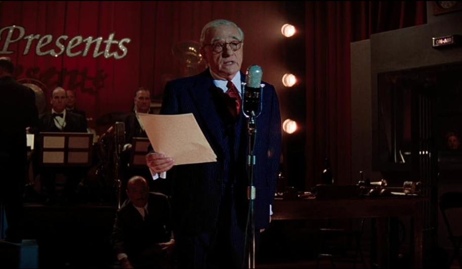

That day, suddenly a movie promo shows up in my timeline with some familiar faces out of nowhere. Yes! That's Leo and De Niro! What a duo paired by el maestro Scorsese!? That time I don't even know Martin Scorsese still active making movie and what the movie about, I haven't read any synopsys or even movie trailer. What I do is just looking for any showtimes at the cinema because I was very excited. After seeing limited showtime (unable to compete with Indonesian's horror movies) I rushed and got a very late night schedule. I'm afraid this type of movie will only be held for short time. Here is my honest review!

## Synopsis
When oil is discovered in 1920s Oklahoma under Osage Nation land, the Osage people are murdered one by one - until the FBI steps in to unravel the mystery [[IMDB](https://www.imdb.com/title/tt5537002/)].

## Movie Details
| Detail      | Body                              |
|-------------|-----------------------------------|
| Duration    | 206 minutes! not long enough yet! |
| Directed By | [Martin Scorsese](https://www.imdb.com/name/nm0000217/) |
| Writers     | [Eric Roth](https://www.imdb.com/name/nm0744839/), [Martin Scorsese](https://www.imdb.com/name/nm0000217/), [David Grann](https://www.imdb.com/name/nm2970418/) |
| Starring    | [Leonardo Dicaprio](https://www.imdb.com/name/nm0000138/), [Robert De Niro](https://www.imdb.com/name/nm0000134/), [Lily Gladstone](https://www.imdb.com/name/nm4291409/) |

## The Story
This movie inspired from true history of dark American History. It tells about Ernest Burkhart, a veteran who try to get a life in his uncle's hometown that is belongs to Indian. He fell in love with Mollie, an Indian rich woman but has health problems. And his uncle, William Hale known to be wise and rich but actually greedy and wants to control her wealth and property. Sounds like some Indonesian drama😂.

I watch this movie without any context and very shocked with the duration of more than 3 hours 😭 Plus i watch it at 9.30pm!

At first I don't understand anything, but the movie consistently gives beautiful visuals just like Black Panther (2018) that emphasizes Indian's culture. The people are very enjoying their lives in simplicity and grateful for the riches that nature provides, which is oil!. The main conflict is as the time goes on, there are more and more newcomers come just only to fight each other and snatch oil. Either by marrying the native civilian, murder, etc.

It will be good if you guys read some of Oasage Indian Tragedy, because the movie don't give much information, at least for first half of the movie. The writer assumes all audiences have the same understanding, but with good story telling, audience that has no context at all will be amazed, curious, and attached to the story and every elements involved. The emotion felt so strong, native civilian are aware that they are being used and marginalized by newcomer that only wanted their wealth. But they have big heart to accept and keep giving chances for newcomers to live side by side.

This movie reminds me a lot of Scorsese's previous movie (The Irishman, Goodfellas) Where it has slow paced story telling, simple and relatable scenes yet has it's own purpose. From the beginning we keep getting curious as the questions keep popup in our head, figuring out what happen, who, where, when, why, and how? But as the movie goes on, that questions will be answered one by one. So, 3 hour duration doesn't feel like enough at all. We will feel that the conflict is over, but it turns out it isn't. Without realizing it, we have been brought to the end of the story, but you will not feel satisfied at all. That's the beauty of cinema.

The ending itself is easy to guess. BTW the ending delivered very well, even beyond my expectations. That is the first time I see such a creative ending where the director literally directly involved.

Acting? De Niro is hella mad with his ambition 😎! Lily Gladstone is the main stars ⭐ in this movie! She has good heart, tought, and genuine. Leo, ya he's very good, but it feels like he was playing himself. Honestly, I'm tired and mad seeing Leo again and again wasting and betraying a woman who sincerely loves him in every movie he played 😡.

> They don't support you, Bill. It is over. There might be some insurrection for a while. But then people forget that. They don't remember and they don't care. It will be another ordinary everyday tragedy.
> 
> -- <cite>William Hale</cite>

## Who Can Enjoy This Movie?
This movie suites well for those who enjoy true-crime drama and prioritizes story quality. If you enjoy Oppenheimer, this movie will deliver stronger feeling. If you enjoy movie with a gangster and Godfather-like feel, here you go.

## Summary
I feel like this movie will be tought rival for Oppenheimer in many upcoming awards. Good delivery keep us focus and patiently waiting for what happens next. This is real Cinema, one of my best 2023 movie so far 😁. 

Final words "sialan gara-gara nonton ni film jam di malem ampe kekunci tengah malem di mall dah kayak episode spongebob kekunci di toko mainan😭"