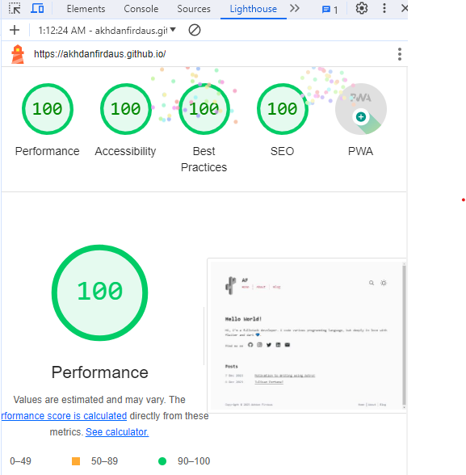
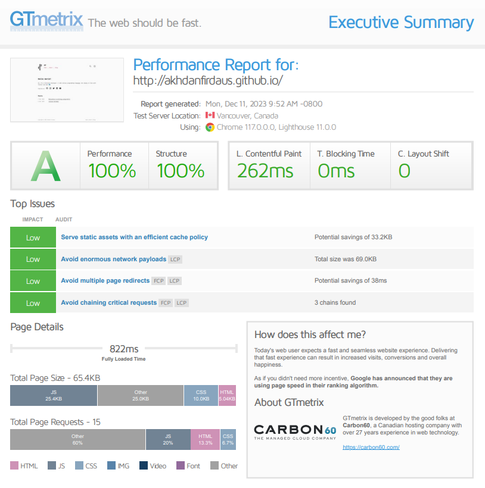
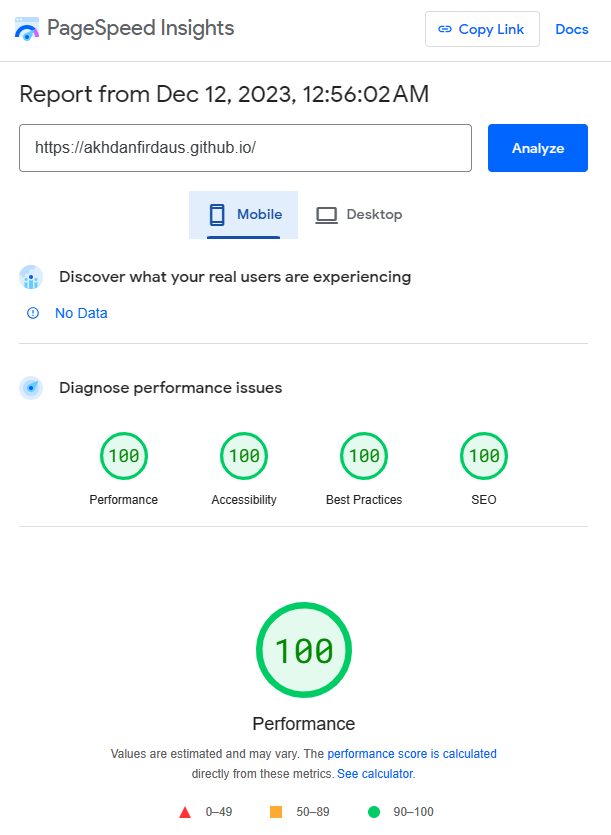

Previously, my personal website is made only by HTML and CSS. Those days I don't think for long-term, I made the website just because it is a task on my university's orientation and I love to code. Some weeks ago, I start doing research about technology I should use for long-term.

## Why Astro?
I don't really like wordpress or blogger. It seems so unfamiliar and not match my style. Finally, my heart fell on Astro because of it's simplicity in syntax and can integrate to any Javascript based framework so it's really easy to customize and the most important thing, it is content-driven framework.

I realize that I can't waste more time to made blog from scratch, fortunately after finish reading and practicing Astrom from it's awesome documentation, the community provide so many starter template. [Astro Cactus](https://github.com/chrismwilliams/astro-theme-cactus) caught my eyes, it is very simple and fulfill all my requirements ❤.

## Aspect of Consideration
- Fully and easy Customize framework for any developer
- Astro is static site generator framework
- Astro is SEO friendly
- Astro can deployed on github pages 😭👌

## Deployment
It only take 3 steps to deploy astro on github pages. First is cloning or start the project from [Astro Cactus](https://github.com/chrismwilliams/astro-theme-cactus) template. Second is change the site metadata like title, author, profile, etc. And third is setup github actions on your repository! hell yeah!! 🔥

## Web Scores
This may looks crazy, but here is thet test result scores:

### Lighthouse

### Gtmetric

### pagespeed
