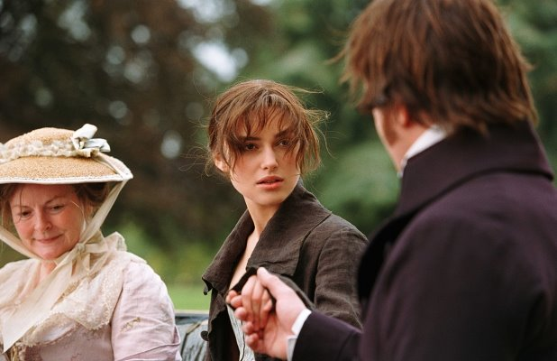

Few weeks ago, I just randomly talks about movies with Sonia. Then the topic enters to "what is the best romance film you have ever watched?". She said enthusiastically there is a movie based on 1813 novel of manners by English author Jane Austen I should watch. I was very interested, especially after finding out that Keira Knightley (Elizabeth Swann in Pirates of Caribbean franchise) is their main actress. Then here is an honest review about the movie.

## Synopsis
Sparks fly when spirited Elizabeth Bennet meets single, rich, and proud Mr. Darcy. But Mr. Darcy reluctantly finds himself falling in love with a woman beneath his class. Can each overcome their own pride and prejudice? [[IMDB](https://www.imdb.com/title/tt0414387/)]

## Movie Details
| Detail      | Body                              |
|-------------|-----------------------------------|
| Duration    | 129 minutes                       |
| Directed By | [Joe Wright](https://www.imdb.com/name/nm0942504) |
| Writers     | [Deborah Moggach](https://www.imdb.com/name/nm0595738/), [Jane Austen](https://www.imdb.com/name/nm0000807/), [Emma Thompson](https://www.imdb.com/name/nm0000668/) |
| Starring    | [Keira Knighley](https://www.imdb.com/name/nm0461136/) ❤, [Matthew Macfadyen](https://www.imdb.com/name/nm0532193/) 🥶, [Rosamund Pike](https://www.imdb.com/name/nm0683253/) |

## The Story
Actually the whole story is very simple! You can guess it by reading the plot of the story. But the main power of this movie is it's pace of storytelling which is very beautiful. The movie forced us to feel how tormented Lizzy's heart from just the middle of the story after unexpected confession from a man that he hated most? We are forced to feel awkward by watching Lizzy's face him. But that makes a  question from us "What are you going to do Lizzy?" til the end of the movie. 

The weak point of the story is the part of why and how Mr. Darcy's fell in love with Lizzy. But it's understandable, from the nature of the character, from the start, Lizzy's who sells expensively and warm at the same time. How can you not love Lizzy, the second child who looks so mature that you feel like she can conquer the world with her gaze 🥰.

> Your Selfish Disdain For The Feelings Of Others Made Me Realize You Were The Last Man In The World I Could Ever Be Prevailed Upon To Marry.
> 
> -- <cite>Elizabeth Bennet</cite>

## Summary
Overall the movie is just right. The actors played their role so natural. The feel of the movie and the main character remind me of Little Women by Greta Gerwig, with a better focus on the main character's storytelling. Mr. Darcy is so me but not in wealth 😂.

Sonia said that this movie just made her feel comfortable because the plot is light, the conflict is not heavy but don't know why it touches her heart. And I agree with that as long as it has good ending 😂. Fortunately after seeing so many sad ending movies, this one has a very satisfying and heartwarming  ending. If not so, I won't forgive you for recommending this movie, Sonia 😠.

Surprisingly we found out that we both have same taste of movie genre. I just want to say thank you for this recommendation. This film cured my feelings of sadness a little lately. 

Final words "Gw gak bisa berpaling sedikitpun dari Keira 🥰".