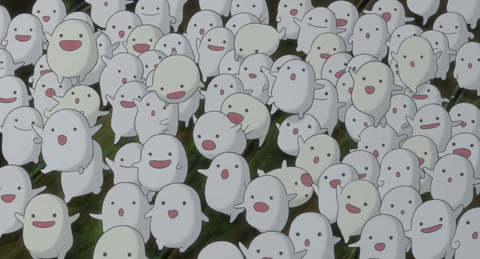
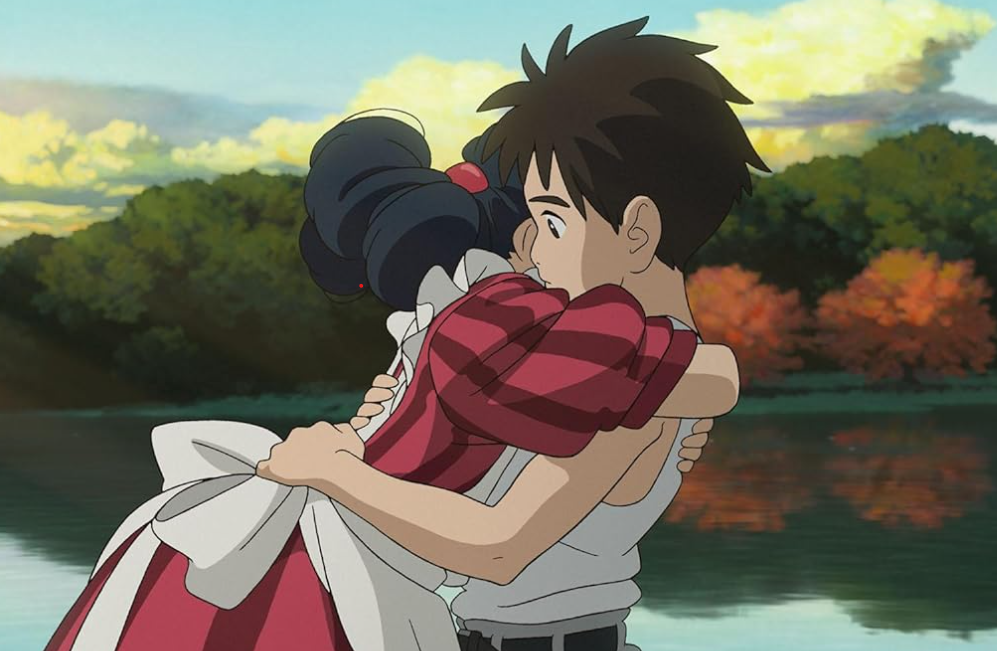

After so long break of writing review, I realize that my review just too spoils everything about the movie. I'll try to start telling more about my personal feels.

This movie might be on my most waited list end-of 2023 movie, because it will be my first Ghibli's movie on big screen with unique promotion in Japan. The movie is so mysterious, there are no video promotion, just only one poster that tell no synopsis. That's a clever way to promote because the Miyazaki-sensei name is just enought to made the hypes.

That's all more than enough to made me put too much expectations on the movie. And maybe that's my mistake, imagining this movie at least will be more better than [Spirited Away](https://www.imdb.com/name/nm0594503/) in terms of storyline.

## Synopsis
A young boy named Mahito yearning for his mother ventures into a world shared by the living and the dead. There, death comes to an end, and life finds a new beginning. A semi-autobiographical fantasy from the mind of Hayao Miyazaki.

## Movie Details
| Detail      | Body                              |
|-------------|-----------------------------------|
| Duration    | 124 minutes                       |
| Director    | [Hayao Miyazaki](https://www.imdb.com/name/nm0594503/) |
| Writers     | [Hayao Miyazaki](https://www.imdb.com/name/nm0594503/) |
| Starring    | [Soma Santoki](https://www.imdb.com/name/nm13177683/), [Masaki Suda](https://www.imdb.com/name/nm4027243/), [Kô Shibasaki](https://www.imdb.com/name/nm0793069/) |

### Movie with Personal touch
This movie is an adaptation from 1937 novel titled "Kimitachi wa Dō Ikiru ka? (How Do You Live?)" by Genzaburō Yoshino. But it has original story by Hayao Miyazaki-sensei, which is not connected to the novel. The main character itself is inspired by Miyazaki-sensei personal life, Mahito (main character) has the same backstory as Miyazaki-sensei while he was young. Throught this movie, we can feel how hard a young boy facing the sadness of being left behind by someone he love, caused him to isolate himself from the world, confused to expressing his sadness and made him becoming closed person. Luckily he has the privilege of living a good life that perevent him to take the wrong step in determining his identity. Everything feels so personal, feels like Miyazaki-sensei is telling the story of his childhood with a touch of a beautiful and peaceful world.

### Unforgotable and Strange Cinema Experience
The movie offers everything you need from cinema, the visual are made by the hand of Miyazaki-sensei for 7 years are paid off. It will catch your eyes for entire movie and that's supported by the beautiful calmly melody that made the movie seems so alive, just like in magical orchestra. It is 2-hour of eyegasm and eargasm you don't realize you need.

Ghibli's known for it's imaginative and beautiful world with rich methapore. As the main title shows, a mix of beauty and uncomfortable feelings succeeded in making goosebumps supported by powerful scoring which will hypnotize us deep into the world. Plus the movie minimal dialogue as Mahito's character don't like to talk too much, which made the movie more mysterious in weird way.

### Meaningful Journey, but not for everyone
Story takes place during WW2, tells about a boy named Mahito, who lost his mother on an accident, not long after that, his father married his mother's sister and take him move to his mother's hometown. Strange thing happened on the first day he move to his new home. He meet a talking heron who said that his mother is still alive. He start to daydreaming, always had a nightmare about his mother, feels terrorized by the heron, and many strange thing happened. That bring him into magical and challenging adventure guided by the heron.

During Mahito's adventure, Miyazaki-sensei try to deliver messages using the most imaginary way, which not everyone will understand the meaning of. So many methaphore that relate to some of religion and belief.

Miyazaki-sensei visualizing about life and death with cute and meaningful series of scenes and characters that flow naturally on this world. Explaining about reincarnation, and karma system "you get what you give" in the most unimaginable way.

And so much scenes that looks surreal yet has meaning of, it kinda hard to understand what's going on, even in some moments we can't differentiate which one is real or not. Unfortunately, the movie feel like rushed at 3/4 part, which made us feel like we've missed the climax moment and suddenly the movie come to end. In the end some questions has the answers and some don't. Make us usatisfied despite the cinema experience we've got.

## Summary
Surprisingly the main conflict is not as complicated and phylosophied as Spirited Away. But it still gave us the same vibes like other ghibli's movie with strong cinema experience. Unfortunately, the plot is just too rushed at the 3/4 part of the movie. Some pivotal moment just flew away because lack of emotion built between the characters, and suddenly we realize the movie came to end. Honestly my react just "Oh", "Thats all?". This movie can engage much more emotion in it, but the concluding was that bad. Just liked the song at the end, the lyrics are incredibly touching.

Another very unfortunate thing is, I failed to invite my crush to watch together, especially this movie haha, because the studio of this movie's name itself always reminding me of her. Glad that she reject it and made me start to stop hoping, atleast for this time. Hoping for director cut version if it is available, because it's very unfortunate that so many things haven't been explored in this fantasy world.

Not a movie that can enjoyed by everyone, but watching it just like seeing beutiful art, feels like we are in art gallery. Long live Miyazaki-sensei, hope you still giving us more beautiful artworks for this generation.
