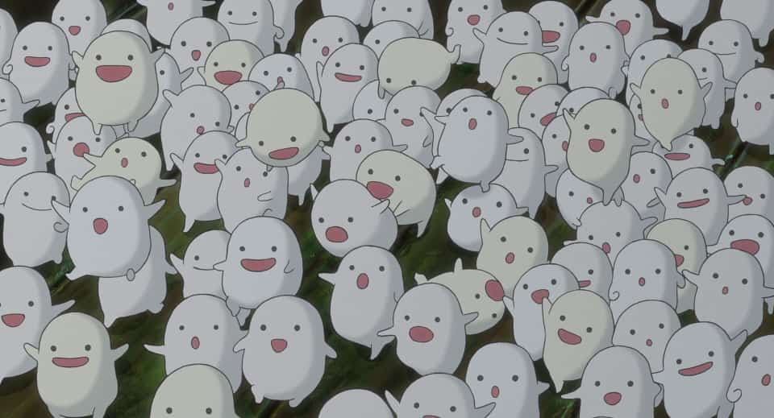
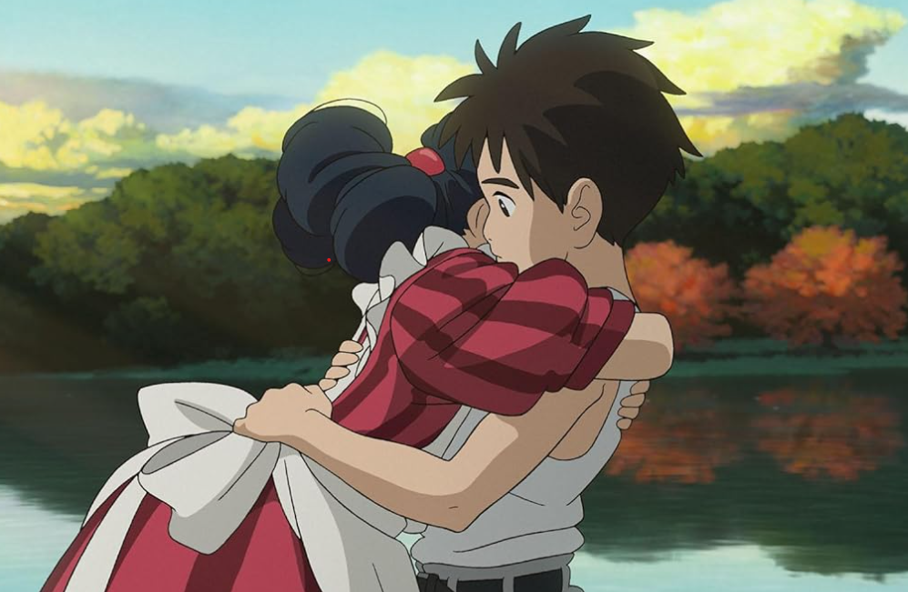

Mungkin ini pertamakalinya aku menonton film Ghibli di layar lebar. Sebisa mungkin kuturunkan ekspetasi pada film ini karena takut apabila tidak sesuai bayanganku, namun aku sangat menantikan film ini dari jauh-jauh hari sekitar bulan agustus mendengar film ini sudah di rilis secara misterius di jepang. Promosi film ini cukup unik, dimana hanya menampilkan sebuah poster tanpa trailer dan lainnya. Nama Ghibli dan Miyazaki-sensei saja sudah cukup untuk membuat film ini laku di Jepang sana, bahkan mungkin dunia. Suatu hal yang tampak tidak mungkin untuk dilakukan oleh film-film zaman sekarang. Membuktikan kepercayaan khalayak umum akan kualitas yang selalu disajikan dibalik oleh dua nama besar tersebut.

## Synopsis
A young boy named Mahito yearning for his mother ventures into a world shared by the living and the dead. There, death comes to an end, and life finds a new beginning. A semi-autobiographical fantasy from the mind of Hayao Miyazaki.

## Movie Details
| Detail      | Body                              |
|-------------|-----------------------------------|
| Duration    | 124 minutes                       |
| Director    | [Hayao Miyazaki](https://www.imdb.com/name/nm0594503/) |
| Writers     | [Hayao Miyazaki](https://www.imdb.com/name/nm0594503/) |
| Starring    | [Soma Santoki](https://www.imdb.com/name/nm13177683/), [Masaki Suda](https://www.imdb.com/name/nm4027243/), [Kô Shibasaki](https://www.imdb.com/name/nm0793069/) |

## Review
Ghibli terkenal akan dunianya yang sangat imajinatif, indah, dan kaya akan metafora. Begitu main title film ini muncul, perasaan aneh, tidak nyaman, menakutkan sekaligus indah sukses membuat bulu kuduk merinding. Banyak sekali hal surealis yang terkadang menimbulkan banyak pertanyaan, bahkan beberapa adegan yang muncul seringkali membuat bingung untuk menentukan mana yang mimpi dan bukan. Hal ini didukung dengan plot cerita mengenai Mahito, seorang anak yang belum bisa menerima kepergian ibunya dan sering bermimpi buruk mengenai itu.

### Main Point
Filmnya berjalan begitu lambat dan penuh tanda tanya di awal. Film sangat berfokus untuk menunjukan aspek visual didukung scoring musik yang indah didengar, banyak sekali adegan minim dialog, sekalinya ada pun hanya sebatas percakapan biasa dengan emosi yang datar.
- Tidak ada yang baik atau buruk di dunia ini, pesan yang coba disampaikan oleh Miyazaki-sensei. Setiap hal memiliki alasannya masing-masing untuk bertindak. Pelikan yang memakan warawara, 
- Bagaimana Mahito berduka dengan selalu memimpikan ibunya, konflik batin, hingga menyebabkan ia menjadi sosok pendiam yang acuh terhadap orang lain. Hingga perjalanan fantasi yang membuatnya lebih memaknai hidup. Sayang sekali penyampaiannya tidak diceritakan begitu baik sehingga penonton tidak terlalu terikat dengan emosi yang dirasakan oleh Mahito ini.
- Konflik yang dimunculkan juga tidak serumit dan seberat film Ghibli biasanya. Namun, Ghibli tetap konsisten memunculkan karakter antagonis yang unik, pada film ini burung parkit pemakan manusia yang lucu
- Metafora yang coba disampaikan terlalu sederhana, kayak perumpamaan surga, tuhan (kayak bruce al mighty, pengen pensiun). Nah si Mahito ini dijadiin penerus gitu wkwkw. Namun konsep waktu yang sedang digandrungi oleh film-film masa kini terlebih setelah adanya film Endgame dan Loki membuat banyak twist yang diluar dugaan.
- Sangat disayangkan, buku yang ditulis ibunya Mahito gak diceritain maksudnya apa. Kayak sayang banget kurang di eksplor buat mengikat emosi penonton padahal Mahito yang kelewat pendiem aja sampe nangis.
- Jujur, banyak scene yang aku tahu ini vital banget buat ceritanya, cuman kayak gak dapet emosi yang ngena banget gitu. Coba aja dibuat lebih dramatis atau karakternya bisa lebih menunjukkan emosi. Reaksi ku hanya sekadar "Oh ternyata ini" "Oh gitu", udah we berlalu aja kurang berbekas. Endingnya kayak udah we gitu aja. Cuman ketolong banget sama lagu di ending, liriknya warbyasa membuat sedih.

### Characters

Seperti makhluk ghibli pada umumnya. Makhluknya luar biasa indah. Aneh-aneh! 
- Ada yang lucuk kayak doodle (warawara) dengan cerita latar belakang nya bagus, kalau udah dewasa jadi balon terus terbang untuk dilahirkan. 
- Pelikan nganggap dunia indah ini neraka karena gada apapun yang bisa diambil di laut, makanya makan warawara. 
- Himi, gadis yang nemenin sepanjang perjalanan, itu sebenernya ibunya si Mahito, sayang sekali pengungkapannya kayak berlalu begitu aja. 
- Si Bango ini lawak bet, diawal nyeremin, nyebelin, bantu karena terpaksa, tapi diakhir adalah teman yang sangat tulus.
- Karakter Mahito (tulus), anak yang terampil bikin alat, disini emang terlihat banget masih belum bisa ikhlas kehilangan ibunya, bikin dia jadi bocah yang berusaha bodoamat sama sekitar jadinya pas ngungkapin hal yang krusial kerasa hambar.

### Visuals
Mengingat film ini dibuat selama 7 tahun dari lukisan tangan karya Miyazaki-sensei, visual yang didapat terasa sangat hidup, seperti menonton lukisan berjalan. Feel indah, warm, creepy, bikin betah setiap frame terasa punya sesuatu yang menjadi daya tarik dan bikin betah memandangnya.

### Scoring
Ada mix beethoven nya pas pindah alam dan ngenalin alam. Kayak orkestra berjalan, tiap adegan dibuat ngena karena scoring dan visualnya.

## Summary

Aspek Visual dan Scoring yang sangat megah dan indah dari Ghibli membuat mata dan telinga sangat terpuaskan oleh setiap frame yang muncul. Penceritaan yang terasa pelan di awal membuat konflik dan penyelesaian yang coba disampaikan terasa terburu-buru dan berlalu begitu saja tanpa meninggalkan perasaan yang berkesan. Andai saja adegan-adegan krusial dibuat lebih ekspresif dan emosional.

Hal lain yang sangat disayangkan adalah setelah beberapa kali percobaan, aku gagal mengajak doi untuk nonton bareng, terutama film ini haha, karena setiap film-film dari studio ini disebut dan di anagramkan pasti namanyalah yang akan pertama muncul di pikiranku, syukurlah ia menolaknya dan membuatku berhenti berharap kepadanya dalam hal apapun, setidaknya untuk saat ini. Maaf atas curhatannya😁. Akankah film ini ada director cut nya? mengingat durasi di bioskop terbatas dan masih banyak yang belum dieksplor dari dunia yang begitu kaya dan indah ini?

Bukan film yang dapat diterima dengan baik bagi semua penikmat Ghibli, namun menontonnya seperti melihat karya seni yang akan indah jika ditafsirkan masing-masing. Semoga Miyazaki-sensei masih diberi umur panjang dalam memberikan lebih banyak untuk karya generasi kita saat ini.